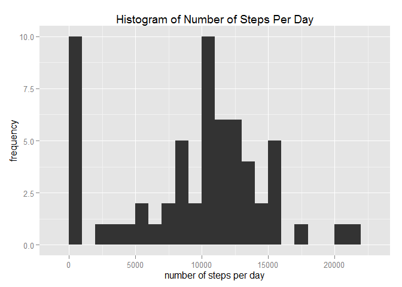
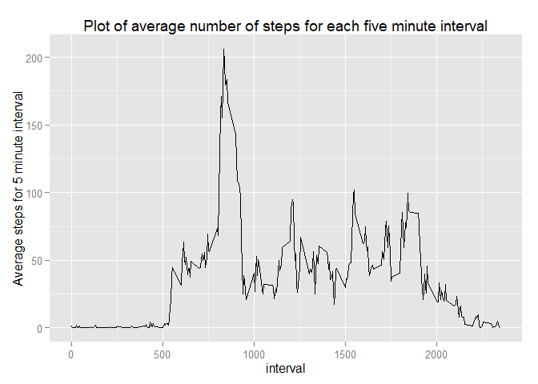
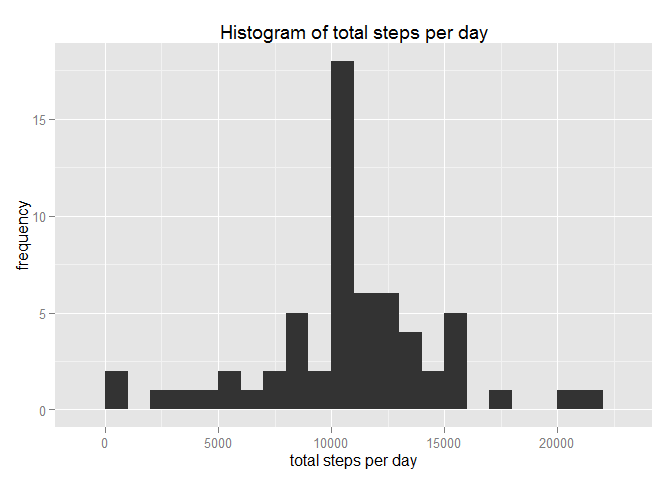
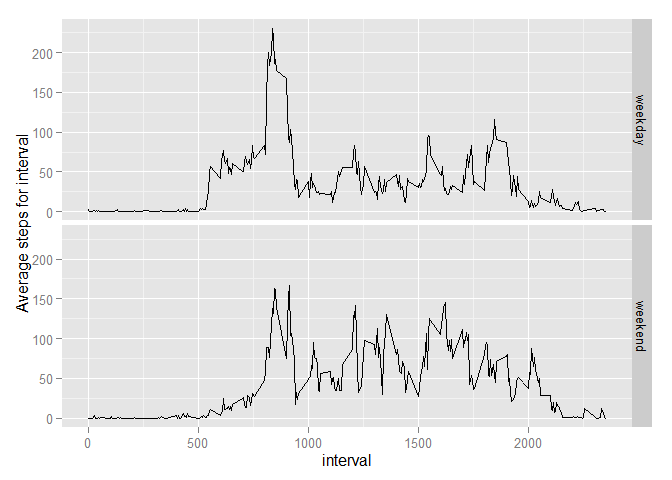

# Reproducible Research: Peer Assessment 1
John Snell  
17 October 2015  


#Introduction
It is now possible to collect a large amount of data about personal movement using activity monitoring devices such as a Fitbit, Nike Fuelband, or Jawbone Up. These type of devices are part of the "quantified self" movement - a group of enthusiasts who take measurements about themselves regularly to improve their health, to find patterns in their behavior, or because they are tech geeks. But these data remain under-utilized both because the raw data are hard to obtain and there is a lack of statistical methods and software for processing and interpreting the data.

This assignment makes use of data from a personal activity monitoring device. This device collects data at 5 minute intervals through out the day. The data consists of two months of data from an anonymous individual collected during the months of October and November, 2012 and include the number of steps taken in 5 minute intervals each day.  


#Data

The data for this assignment can be downloaded from the course web site:

Dataset: Activity monitoring data [52K]
The variables included in this dataset are:   
**steps**: Number of steps taking in a 5-minute interval (missing values are coded as NA)  
**date**: The date on which the measurement was taken in YYYY-MM-DD format  
**interval**: Identifier for the 5-minute interval in which measurement was taken

The dataset is stored in a comma-separated-value (CSV) file and there are a total of **17,568** observations in this dataset.   

#Assignment

This assignment will be described in multiple parts. You will need to write a report that answers the questions detailed below. Ultimately, you will need to complete the entire assignment in a single R markdown document that can be processed by knitr and be transformed into an HTML file.

Throughout your report make sure you always include the code that you used to generate the output you present. When writing code chunks in the R markdown document, always use echo = TRUE so that someone else will be able to read the code. This assignment will be evaluated via peer assessment so it is essential that your peer evaluators be able to review the code for your analysis.

For the plotting aspects of this assignment, feel free to use any plotting system in R (i.e., base, lattice, ggplot2)

*Fork/clone the GitHub repository created for this assignment.*
You will submit this assignment by pushing your completed files into your forked repository on GitHub. The assignment submission will consist of the URL to your GitHub repository and the SHA-1 commit ID for your repository state.

NOTE: The GitHub repository also contains the dataset for the assignment so you do not have to download the data separately.

Loading and preprocessing the data

Show any code that is needed to

## Loading and preprocessing the data
*Load the data (i.e. read.csv())*


```r
##setwd(".\\RepData_PeerAssessment1")
activity<-read.csv("activity.csv")
```

Process/transform the data (if necessary) into a format suitable for your analysis.   


##What is mean total number of steps taken per day?

load the dplyr library to group the raw data on a per day basis.


```r
library(dplyr)
```

```
## 
## Attaching package: 'dplyr'
## 
## The following objects are masked from 'package:stats':
## 
##     filter, lag
## 
## The following objects are masked from 'package:base':
## 
##     intersect, setdiff, setequal, union
```

```r
activity_per_day<-group_by(activity,date)
```

For this part of the assignment, missing values in the dataset are ignored.

###Calculate the total number of steps taken per day.

Using the summarise function from dplyr on the grouped data.


```r
sumsteps<-summarise(activity_per_day, sumstep = sum(steps, na.rm=TRUE))
print.data.frame(sumsteps)
```

```
##          date sumstep
## 1  2012-10-01       0
## 2  2012-10-02     126
## 3  2012-10-03   11352
## 4  2012-10-04   12116
## 5  2012-10-05   13294
## 6  2012-10-06   15420
## 7  2012-10-07   11015
## 8  2012-10-08       0
## 9  2012-10-09   12811
## 10 2012-10-10    9900
## 11 2012-10-11   10304
## 12 2012-10-12   17382
## 13 2012-10-13   12426
## 14 2012-10-14   15098
## 15 2012-10-15   10139
## 16 2012-10-16   15084
## 17 2012-10-17   13452
## 18 2012-10-18   10056
## 19 2012-10-19   11829
## 20 2012-10-20   10395
## 21 2012-10-21    8821
## 22 2012-10-22   13460
## 23 2012-10-23    8918
## 24 2012-10-24    8355
## 25 2012-10-25    2492
## 26 2012-10-26    6778
## 27 2012-10-27   10119
## 28 2012-10-28   11458
## 29 2012-10-29    5018
## 30 2012-10-30    9819
## 31 2012-10-31   15414
## 32 2012-11-01       0
## 33 2012-11-02   10600
## 34 2012-11-03   10571
## 35 2012-11-04       0
## 36 2012-11-05   10439
## 37 2012-11-06    8334
## 38 2012-11-07   12883
## 39 2012-11-08    3219
## 40 2012-11-09       0
## 41 2012-11-10       0
## 42 2012-11-11   12608
## 43 2012-11-12   10765
## 44 2012-11-13    7336
## 45 2012-11-14       0
## 46 2012-11-15      41
## 47 2012-11-16    5441
## 48 2012-11-17   14339
## 49 2012-11-18   15110
## 50 2012-11-19    8841
## 51 2012-11-20    4472
## 52 2012-11-21   12787
## 53 2012-11-22   20427
## 54 2012-11-23   21194
## 55 2012-11-24   14478
## 56 2012-11-25   11834
## 57 2012-11-26   11162
## 58 2012-11-27   13646
## 59 2012-11-28   10183
## 60 2012-11-29    7047
## 61 2012-11-30       0
```

###Presenting the total number of steps taken each day as a histogram.


load the ggplot functionality and use qplot to plot the histogram.


```r
library(ggplot2)
qplot(sumstep,data=sumsteps,xlab = "number of steps per day", ylab="frequency", 
      main="Histogram of Number of Steps Per Day", binwidth=1000)
```

 

###Calculate and report the mean and median of the total number of steps taken per day


```r
summarise(sumsteps,"mean steps per day"=mean(sumstep),
          "median steps per day"=median(sumstep))
```

```
## Source: local data frame [1 x 2]
## 
##   mean steps per day median steps per day
## 1            9354.23                10395
```

##What is the average daily activity pattern?

###Make a time series plot (i.e. type = "l") of the 5-minute interval (x-axis) 
###and the average number of steps taken, averaged across all days (y-axis)
*modify activity dataframe by adding a column by converting interval to five minute timed interval.*

```r
activityintervals<-activity$interval
activity$fivemininterval<-substr(as.POSIXct(sprintf("%04.0f", activityintervals), 
                                            format='%H%M'), 12, 16)
```

*group by 5 minutes timed interval.*

```r
stepsbyinterval<-group_by(activity,interval)
```

*establish average of each 5 minute slot across all days*

```r
averagestepsbyinterval<-summarise(stepsbyinterval,
                                  averagestepsforinterval=mean(steps,na.rm = TRUE))
print.data.frame(averagestepsbyinterval)
```

```
##     interval averagestepsforinterval
## 1          0               1.7169811
## 2          5               0.3396226
## 3         10               0.1320755
## 4         15               0.1509434
## 5         20               0.0754717
## 6         25               2.0943396
## 7         30               0.5283019
## 8         35               0.8679245
## 9         40               0.0000000
## 10        45               1.4716981
## 11        50               0.3018868
## 12        55               0.1320755
## 13       100               0.3207547
## 14       105               0.6792453
## 15       110               0.1509434
## 16       115               0.3396226
## 17       120               0.0000000
## 18       125               1.1132075
## 19       130               1.8301887
## 20       135               0.1698113
## 21       140               0.1698113
## 22       145               0.3773585
## 23       150               0.2641509
## 24       155               0.0000000
## 25       200               0.0000000
## 26       205               0.0000000
## 27       210               1.1320755
## 28       215               0.0000000
## 29       220               0.0000000
## 30       225               0.1320755
## 31       230               0.0000000
## 32       235               0.2264151
## 33       240               0.0000000
## 34       245               0.0000000
## 35       250               1.5471698
## 36       255               0.9433962
## 37       300               0.0000000
## 38       305               0.0000000
## 39       310               0.0000000
## 40       315               0.0000000
## 41       320               0.2075472
## 42       325               0.6226415
## 43       330               1.6226415
## 44       335               0.5849057
## 45       340               0.4905660
## 46       345               0.0754717
## 47       350               0.0000000
## 48       355               0.0000000
## 49       400               1.1886792
## 50       405               0.9433962
## 51       410               2.5660377
## 52       415               0.0000000
## 53       420               0.3396226
## 54       425               0.3584906
## 55       430               4.1132075
## 56       435               0.6603774
## 57       440               3.4905660
## 58       445               0.8301887
## 59       450               3.1132075
## 60       455               1.1132075
## 61       500               0.0000000
## 62       505               1.5660377
## 63       510               3.0000000
## 64       515               2.2452830
## 65       520               3.3207547
## 66       525               2.9622642
## 67       530               2.0943396
## 68       535               6.0566038
## 69       540              16.0188679
## 70       545              18.3396226
## 71       550              39.4528302
## 72       555              44.4905660
## 73       600              31.4905660
## 74       605              49.2641509
## 75       610              53.7735849
## 76       615              63.4528302
## 77       620              49.9622642
## 78       625              47.0754717
## 79       630              52.1509434
## 80       635              39.3396226
## 81       640              44.0188679
## 82       645              44.1698113
## 83       650              37.3584906
## 84       655              49.0377358
## 85       700              43.8113208
## 86       705              44.3773585
## 87       710              50.5094340
## 88       715              54.5094340
## 89       720              49.9245283
## 90       725              50.9811321
## 91       730              55.6792453
## 92       735              44.3207547
## 93       740              52.2641509
## 94       745              69.5471698
## 95       750              57.8490566
## 96       755              56.1509434
## 97       800              73.3773585
## 98       805              68.2075472
## 99       810             129.4339623
## 100      815             157.5283019
## 101      820             171.1509434
## 102      825             155.3962264
## 103      830             177.3018868
## 104      835             206.1698113
## 105      840             195.9245283
## 106      845             179.5660377
## 107      850             183.3962264
## 108      855             167.0188679
## 109      900             143.4528302
## 110      905             124.0377358
## 111      910             109.1132075
## 112      915             108.1132075
## 113      920             103.7169811
## 114      925              95.9622642
## 115      930              66.2075472
## 116      935              45.2264151
## 117      940              24.7924528
## 118      945              38.7547170
## 119      950              34.9811321
## 120      955              21.0566038
## 121     1000              40.5660377
## 122     1005              26.9811321
## 123     1010              42.4150943
## 124     1015              52.6603774
## 125     1020              38.9245283
## 126     1025              50.7924528
## 127     1030              44.2830189
## 128     1035              37.4150943
## 129     1040              34.6981132
## 130     1045              28.3396226
## 131     1050              25.0943396
## 132     1055              31.9433962
## 133     1100              31.3584906
## 134     1105              29.6792453
## 135     1110              21.3207547
## 136     1115              25.5471698
## 137     1120              28.3773585
## 138     1125              26.4716981
## 139     1130              33.4339623
## 140     1135              49.9811321
## 141     1140              42.0377358
## 142     1145              44.6037736
## 143     1150              46.0377358
## 144     1155              59.1886792
## 145     1200              63.8679245
## 146     1205              87.6981132
## 147     1210              94.8490566
## 148     1215              92.7735849
## 149     1220              63.3962264
## 150     1225              50.1698113
## 151     1230              54.4716981
## 152     1235              32.4150943
## 153     1240              26.5283019
## 154     1245              37.7358491
## 155     1250              45.0566038
## 156     1255              67.2830189
## 157     1300              42.3396226
## 158     1305              39.8867925
## 159     1310              43.2641509
## 160     1315              40.9811321
## 161     1320              46.2452830
## 162     1325              56.4339623
## 163     1330              42.7547170
## 164     1335              25.1320755
## 165     1340              39.9622642
## 166     1345              53.5471698
## 167     1350              47.3207547
## 168     1355              60.8113208
## 169     1400              55.7547170
## 170     1405              51.9622642
## 171     1410              43.5849057
## 172     1415              48.6981132
## 173     1420              35.4716981
## 174     1425              37.5471698
## 175     1430              41.8490566
## 176     1435              27.5094340
## 177     1440              17.1132075
## 178     1445              26.0754717
## 179     1450              43.6226415
## 180     1455              43.7735849
## 181     1500              30.0188679
## 182     1505              36.0754717
## 183     1510              35.4905660
## 184     1515              38.8490566
## 185     1520              45.9622642
## 186     1525              47.7547170
## 187     1530              48.1320755
## 188     1535              65.3207547
## 189     1540              82.9056604
## 190     1545              98.6603774
## 191     1550             102.1132075
## 192     1555              83.9622642
## 193     1600              62.1320755
## 194     1605              64.1320755
## 195     1610              74.5471698
## 196     1615              63.1698113
## 197     1620              56.9056604
## 198     1625              59.7735849
## 199     1630              43.8679245
## 200     1635              38.5660377
## 201     1640              44.6603774
## 202     1645              45.4528302
## 203     1650              46.2075472
## 204     1655              43.6792453
## 205     1700              46.6226415
## 206     1705              56.3018868
## 207     1710              50.7169811
## 208     1715              61.2264151
## 209     1720              72.7169811
## 210     1725              78.9433962
## 211     1730              68.9433962
## 212     1735              59.6603774
## 213     1740              75.0943396
## 214     1745              56.5094340
## 215     1750              34.7735849
## 216     1755              37.4528302
## 217     1800              40.6792453
## 218     1805              58.0188679
## 219     1810              74.6981132
## 220     1815              85.3207547
## 221     1820              59.2641509
## 222     1825              67.7735849
## 223     1830              77.6981132
## 224     1835              74.2452830
## 225     1840              85.3396226
## 226     1845              99.4528302
## 227     1850              86.5849057
## 228     1855              85.6037736
## 229     1900              84.8679245
## 230     1905              77.8301887
## 231     1910              58.0377358
## 232     1915              53.3584906
## 233     1920              36.3207547
## 234     1925              20.7169811
## 235     1930              27.3962264
## 236     1935              40.0188679
## 237     1940              30.2075472
## 238     1945              25.5471698
## 239     1950              45.6603774
## 240     1955              33.5283019
## 241     2000              19.6226415
## 242     2005              19.0188679
## 243     2010              19.3396226
## 244     2015              33.3396226
## 245     2020              26.8113208
## 246     2025              21.1698113
## 247     2030              27.3018868
## 248     2035              21.3396226
## 249     2040              19.5471698
## 250     2045              21.3207547
## 251     2050              32.3018868
## 252     2055              20.1509434
## 253     2100              15.9433962
## 254     2105              17.2264151
## 255     2110              23.4528302
## 256     2115              19.2452830
## 257     2120              12.4528302
## 258     2125               8.0188679
## 259     2130              14.6603774
## 260     2135              16.3018868
## 261     2140               8.6792453
## 262     2145               7.7924528
## 263     2150               8.1320755
## 264     2155               2.6226415
## 265     2200               1.4528302
## 266     2205               3.6792453
## 267     2210               4.8113208
## 268     2215               8.5094340
## 269     2220               7.0754717
## 270     2225               8.6981132
## 271     2230               9.7547170
## 272     2235               2.2075472
## 273     2240               0.3207547
## 274     2245               0.1132075
## 275     2250               1.6037736
## 276     2255               4.6037736
## 277     2300               3.3018868
## 278     2305               2.8490566
## 279     2310               0.0000000
## 280     2315               0.8301887
## 281     2320               0.9622642
## 282     2325               1.5849057
## 283     2330               2.6037736
## 284     2335               4.6981132
## 285     2340               3.3018868
## 286     2345               0.6415094
## 287     2350               0.2264151
## 288     2355               1.0754717
```

```r
qplot(interval, averagestepsforinterval,data = averagestepsbyinterval, geom='line',xlab="interval",ylab="Average steps for 5 minute interval",
      main="Plot of average number of steps for each five minute interval")
```

 

###Which 5-minute interval, on average across all the days in the dataset, 
###contains the maximum number of steps?


```r
 averagestepsbyinterval[which.max(averagestepsbyinterval$averagestepsforinterval),]
```

```
## Source: local data frame [1 x 2]
## 
##   interval averagestepsforinterval
## 1      835                206.1698
```

##Imputing missing values.

Note that there are a number of days/intervals where there are missing values (coded as NA). The presence of missing days may introduce bias into some calculations or summaries of the data.

###Calculate and report the total number of missing values in the dataset (i.e. the total number of rows with NAs).

```r
sum(is.na(activity))
```

```
## [1] 2304
```

Devise a strategy for filling in all of the missing values in the dataset. The 
strategy does not need to be sophisticated. For example, you could use the 
mean/median for that day, or the mean for that 5-minute interval, etc.

make a copy of the activity matrix
group by fiveminuteinterval
fill in na's based on the average steps for that specific time interval

```r
filledactivity<-activity
filledactivity<-group_by(filledactivity,fivemininterval)
averagedintervalsforfilledactivity<-summarise(filledactivity,
                                        meanintervalstep=mean(steps,na.rm=TRUE))
```
*Create a new dataset that is equal to the original dataset but with the missing* 
*data filled in.*


```r
#this algorithm steps through the activity data frame and wherever there is an NA 
#in the steps column, it fills it in with the average value of that interval, where
#the average is taken across all days for which there is data.
#
i = 1
while (i <= nrow(filledactivity))
{
        j=0
        while (j < nrow(averagedintervalsforfilledactivity)) 
                #number of rows corresponds to the numer of intervals in a day
        {
                if (is.na(filledactivity$steps[i + j]))
                {
                        filledactivity$steps[i + j] <-
                        averagedintervalsforfilledactivity$meanintervalstep[j+1]
                }
                j = j+ 1 #adjust the inner loop counter
        }
        
        i = i + j #adjust the out loop counter
}
```

*Make a histogram of the total number of steps taken each day.*


```r
filledactivity<-group_by(filledactivity,date)
totalstepsperday<-summarise(filledactivity,totalsteps = sum(steps))
print.data.frame(totalstepsperday)
```

```
##          date totalsteps
## 1  2012-10-01   10766.19
## 2  2012-10-02     126.00
## 3  2012-10-03   11352.00
## 4  2012-10-04   12116.00
## 5  2012-10-05   13294.00
## 6  2012-10-06   15420.00
## 7  2012-10-07   11015.00
## 8  2012-10-08   10766.19
## 9  2012-10-09   12811.00
## 10 2012-10-10    9900.00
## 11 2012-10-11   10304.00
## 12 2012-10-12   17382.00
## 13 2012-10-13   12426.00
## 14 2012-10-14   15098.00
## 15 2012-10-15   10139.00
## 16 2012-10-16   15084.00
## 17 2012-10-17   13452.00
## 18 2012-10-18   10056.00
## 19 2012-10-19   11829.00
## 20 2012-10-20   10395.00
## 21 2012-10-21    8821.00
## 22 2012-10-22   13460.00
## 23 2012-10-23    8918.00
## 24 2012-10-24    8355.00
## 25 2012-10-25    2492.00
## 26 2012-10-26    6778.00
## 27 2012-10-27   10119.00
## 28 2012-10-28   11458.00
## 29 2012-10-29    5018.00
## 30 2012-10-30    9819.00
## 31 2012-10-31   15414.00
## 32 2012-11-01   10766.19
## 33 2012-11-02   10600.00
## 34 2012-11-03   10571.00
## 35 2012-11-04   10766.19
## 36 2012-11-05   10439.00
## 37 2012-11-06    8334.00
## 38 2012-11-07   12883.00
## 39 2012-11-08    3219.00
## 40 2012-11-09   10766.19
## 41 2012-11-10   10766.19
## 42 2012-11-11   12608.00
## 43 2012-11-12   10765.00
## 44 2012-11-13    7336.00
## 45 2012-11-14   10766.19
## 46 2012-11-15      41.00
## 47 2012-11-16    5441.00
## 48 2012-11-17   14339.00
## 49 2012-11-18   15110.00
## 50 2012-11-19    8841.00
## 51 2012-11-20    4472.00
## 52 2012-11-21   12787.00
## 53 2012-11-22   20427.00
## 54 2012-11-23   21194.00
## 55 2012-11-24   14478.00
## 56 2012-11-25   11834.00
## 57 2012-11-26   11162.00
## 58 2012-11-27   13646.00
## 59 2012-11-28   10183.00
## 60 2012-11-29    7047.00
## 61 2012-11-30   10766.19
```

```r
qplot(totalsteps,data = totalstepsperday, binwidth = 1000, xlab="total steps per day",
      ylab = "frequency", main = "Histogram of total steps per day")
```

 

*Calculate and report the mean and median total number of steps taken per day.*

```r
summarise(totalstepsperday,"mean steps per day"=mean(totalsteps),"median steps per day"=median(totalsteps))
```

```
## Source: local data frame [1 x 2]
## 
##   mean steps per day median steps per day
## 1           10766.19             10766.19
```

*Do these values differ from the estimates from the first part of the assignment?*

**Yes - both mean and median have increased in value.**

*What is the impact of imputing missing data on the estimates of the total daily number of steps?*

**Both the mean and median values are increased relative to the first part of the** 
**assignment where blank data was simply omitted.**
**The mean and the median are now the same value which fits in with the shape of **
**the histogram which is consderably more symmetrical than the histogram in the **
**first part of the assignment. Both the mean and median have increased in value **
**relative to the first part as would be expected since we are injecting values **
**into the dataset.**

##Are there differences in activity patterns between weekdays and weekends?

For this part the weekdays() function may be of some help here. Use the dataset with the filled-in missing values for this part.

*Create a new factor variable in the dataset with two levels - "weekday" and "weekend" indicating whether a given date is a weekday or weekend day.*

```r
#create a new variable in filledactivity and fill it by detecting whether the 
#row date for this interval is a weekend or a weekday. 
filledactivity$daytype<-ifelse(weekdays(as.Date(filledactivity$date)) %in% c("Saturday","Sunday"),"weekend","weekday")

#convert the new column from character to factor
filledactivity$daytype<-as.factor(filledactivity$daytype)
```


*Make a panel plot containing a time series plot (i.e. type = "l") of the 5-minute interval (x-axis) and the average number of steps taken, averaged across all weekday days or weekend days (y-axis). See the README file in the GitHub repository to see an example of what this plot should look like using simulated data.*   

```r
#two layers of grouping - intially by type of day and then by interval
groupedfilledactivity<-group_by(filledactivity, daytype,interval)
#produce summary data which is the average number of steps for an interval across
#all days of a specfic day type
summarydata<-summarise(groupedfilledactivity, averagestepsbyinterval=mean(steps))
#present results
print.data.frame(summarydata)
```

```
##     daytype interval averagestepsbyinterval
## 1   weekday        0           2.251153e+00
## 2   weekday        5           4.452830e-01
## 3   weekday       10           1.731656e-01
## 4   weekday       15           1.979036e-01
## 5   weekday       20           9.895178e-02
## 6   weekday       25           1.590356e+00
## 7   weekday       30           6.926625e-01
## 8   weekday       35           1.137945e+00
## 9   weekday       40           0.000000e+00
## 10  weekday       45           1.796226e+00
## 11  weekday       50           3.958071e-01
## 12  weekday       55           1.761006e-02
## 13  weekday      100           4.205451e-01
## 14  weekday      105           9.056604e-02
## 15  weekday      110           1.979036e-01
## 16  weekday      115           4.452830e-01
## 17  weekday      120           0.000000e+00
## 18  weekday      125           1.459539e+00
## 19  weekday      130           2.221803e+00
## 20  weekday      135           2.264151e-02
## 21  weekday      140           2.226415e-01
## 22  weekday      145           2.503145e-01
## 23  weekday      150           3.463312e-01
## 24  weekday      155           0.000000e+00
## 25  weekday      200           0.000000e+00
## 26  weekday      205           0.000000e+00
## 27  weekday      210           1.395388e+00
## 28  weekday      215           0.000000e+00
## 29  weekday      220           0.000000e+00
## 30  weekday      225           1.731656e-01
## 31  weekday      230           0.000000e+00
## 32  weekday      235           2.968553e-01
## 33  weekday      240           0.000000e+00
## 34  weekday      245           0.000000e+00
## 35  weekday      250           2.028512e+00
## 36  weekday      255           1.236897e+00
## 37  weekday      300           0.000000e+00
## 38  weekday      305           0.000000e+00
## 39  weekday      310           0.000000e+00
## 40  weekday      315           0.000000e+00
## 41  weekday      320           2.767296e-02
## 42  weekday      325           8.163522e-01
## 43  weekday      330           1.238574e+00
## 44  weekday      335           5.224319e-01
## 45  weekday      340           4.209644e-01
## 46  weekday      345           9.895178e-02
## 47  weekday      350           0.000000e+00
## 48  weekday      355           0.000000e+00
## 49  weekday      400           2.696017e-01
## 50  weekday      405           1.236897e+00
## 51  weekday      410           2.231027e+00
## 52  weekday      415           0.000000e+00
## 53  weekday      420           4.452830e-01
## 54  weekday      425           4.779874e-02
## 55  weekday      430           3.370650e+00
## 56  weekday      435           2.213836e-01
## 57  weekday      440           3.776520e+00
## 58  weekday      445           8.884696e-01
## 59  weekday      450           2.348428e+00
## 60  weekday      455           7.262055e-01
## 61  weekday      500           0.000000e+00
## 62  weekday      505           2.053249e+00
## 63  weekday      510           3.933333e+00
## 64  weekday      515           2.188260e+00
## 65  weekday      520           4.220545e+00
## 66  weekday      525           2.706080e+00
## 67  weekday      530           2.745912e+00
## 68  weekday      535           7.940881e+00
## 69  weekday      540           2.040252e+01
## 70  weekday      545           2.364528e+01
## 71  weekday      550           5.034927e+01
## 72  weekday      555           5.626541e+01
## 73  weekday      600           4.128763e+01
## 74  weekday      605           6.459078e+01
## 75  weekday      610           7.008092e+01
## 76  weekday      615           7.714927e+01
## 77  weekday      620           6.392830e+01
## 78  weekday      625           6.003229e+01
## 79  weekday      630           6.644235e+01
## 80  weekday      635           4.797862e+01
## 81  weekday      640           5.566918e+01
## 82  weekday      645           5.486709e+01
## 83  weekday      650           4.704780e+01
## 84  weekday      655           6.042725e+01
## 85  weekday      700           5.059706e+01
## 86  weekday      705           5.082809e+01
## 87  weekday      710           6.202348e+01
## 88  weekday      715           6.933459e+01
## 89  weekday      720           6.310105e+01
## 90  weekday      725           5.910860e+01
## 91  weekday      730           6.622390e+01
## 92  weekday      735           5.435388e+01
## 93  weekday      740           6.272411e+01
## 94  weekday      745           8.338407e+01
## 95  weekday      750           6.773543e+01
## 96  weekday      755           6.657568e+01
## 97  weekday      800           8.271698e+01
## 98  weekday      805           7.196101e+01
## 99  weekday      810           1.440134e+02
## 100 weekday      815           1.819816e+02
## 101 weekday      820           2.005757e+02
## 102 weekday      825           1.836084e+02
## 103 weekday      830           1.988847e+02
## 104 weekday      835           2.303782e+02
## 105 weekday      840           2.189010e+02
## 106 weekday      845           1.856532e+02
## 107 weekday      850           1.912306e+02
## 108 weekday      855           1.770914e+02
## 109 weekday      900           1.676604e+02
## 110 weekday      905           1.257828e+02
## 111 weekday      910           9.394843e+01
## 112 weekday      915           8.730398e+01
## 113 weekday      920           1.035400e+02
## 114 weekday      925           9.246164e+01
## 115 weekday      930           5.851656e+01
## 116 weekday      935           3.585241e+01
## 117 weekday      940           2.746122e+01
## 118 weekday      945           4.085618e+01
## 119 weekday      950           3.913082e+01
## 120 weekday      955           1.762977e+01
## 121 weekday     1000           3.787547e+01
## 122 weekday     1005           1.821971e+01
## 123 weekday     1010           3.907757e+01
## 124 weekday     1015           4.782138e+01
## 125 weekday     1020           3.034549e+01
## 126 weekday     1025           3.515010e+01
## 127 weekday     1030           3.312662e+01
## 128 weekday     1035           2.425535e+01
## 129 weekday     1040           2.351530e+01
## 130 weekday     1045           2.591195e+01
## 131 weekday     1050           2.203480e+01
## 132 weekday     1055           2.325912e+01
## 133 weekday     1100           2.169224e+01
## 134 weekday     1105           2.509057e+01
## 135 weekday     1110           1.168721e+01
## 136 weekday     1115           1.627296e+01
## 137 weekday     1120           2.418365e+01
## 138 weekday     1125           2.372956e+01
## 139 weekday     1130           3.276897e+01
## 140 weekday     1135           5.019748e+01
## 141 weekday     1140           4.456059e+01
## 142 weekday     1145           4.792495e+01
## 143 weekday     1150           5.011614e+01
## 144 weekday     1155           5.613627e+01
## 145 weekday     1200           5.571572e+01
## 146 weekday     1205           7.284864e+01
## 147 weekday     1210           8.364654e+01
## 148 weekday     1215           7.528092e+01
## 149 weekday     1220           4.871950e+01
## 150 weekday     1225           4.682264e+01
## 151 weekday     1230           6.257400e+01
## 152 weekday     1235           3.074423e+01
## 153 weekday     1240           2.198155e+01
## 154 weekday     1245           2.932034e+01
## 155 weekday     1250           3.278532e+01
## 156 weekday     1255           5.659329e+01
## 157 weekday     1300           2.460084e+01
## 158 weekday     1305           2.574046e+01
## 159 weekday     1310           2.456855e+01
## 160 weekday     1315           1.564193e+01
## 161 weekday     1320           3.563270e+01
## 162 weekday     1325           4.485786e+01
## 163 weekday     1330           3.176730e+01
## 164 weekday     1335           2.330650e+01
## 165 weekday     1340           2.523941e+01
## 166 weekday     1345           4.018407e+01
## 167 weekday     1350           2.557610e+01
## 168 weekday     1355           3.633040e+01
## 169 weekday     1400           4.692285e+01
## 170 weekday     1405           3.955052e+01
## 171 weekday     1410           3.212243e+01
## 172 weekday     1415           4.504864e+01
## 173 weekday     1420           2.748512e+01
## 174 weekday     1425           3.076184e+01
## 175 weekday     1430           3.149099e+01
## 176 weekday     1435           1.451237e+01
## 177 weekday     1440           1.154843e+01
## 178 weekday     1445           2.198784e+01
## 179 weekday     1450           4.186080e+01
## 180 weekday     1455           3.828092e+01
## 181 weekday     1500           3.086918e+01
## 182 weekday     1505           3.505451e+01
## 183 weekday     1510           2.995430e+01
## 184 weekday     1515           3.191321e+01
## 185 weekday     1520           3.986164e+01
## 186 weekday     1525           3.734507e+01
## 187 weekday     1530           4.212872e+01
## 188 weekday     1535           5.093166e+01
## 189 weekday     1540           9.056520e+01
## 190 weekday     1545           9.586583e+01
## 191 weekday     1550           9.394843e+01
## 192 weekday     1555           7.030608e+01
## 193 weekday     1600           4.688428e+01
## 194 weekday     1605           4.519539e+01
## 195 weekday     1610           5.660629e+01
## 196 weekday     1615           3.613375e+01
## 197 weekday     1620           2.680964e+01
## 198 weekday     1625           2.952537e+01
## 199 weekday     1630           2.251572e+01
## 200 weekday     1635           2.183103e+01
## 201 weekday     1640           2.586583e+01
## 202 weekday     1645           3.199371e+01
## 203 weekday     1650           2.762767e+01
## 204 weekday     1655           3.242390e+01
## 205 weekday     1700           2.357191e+01
## 206 weekday     1705           4.495136e+01
## 207 weekday     1710           3.418449e+01
## 208 weekday     1715           4.807463e+01
## 209 weekday     1720           6.011782e+01
## 210 weekday     1725           7.237023e+01
## 211 weekday     1730           5.614801e+01
## 212 weekday     1735           6.582138e+01
## 213 weekday     1740           8.287925e+01
## 214 weekday     1745           5.933459e+01
## 215 weekday     1750           3.450314e+01
## 216 weekday     1755           3.759371e+01
## 217 weekday     1800           2.664612e+01
## 218 weekday     1805           4.662474e+01
## 219 weekday     1810           6.722642e+01
## 220 weekday     1815           8.264277e+01
## 221 weekday     1820           6.139078e+01
## 222 weekday     1825           7.345870e+01
## 223 weekday     1830           7.922642e+01
## 224 weekday     1835           8.149937e+01
## 225 weekday     1840           9.171195e+01
## 226 weekday     1845           1.154604e+02
## 227 weekday     1850           1.013002e+02
## 228 weekday     1855           9.059161e+01
## 229 weekday     1900           8.756017e+01
## 230 weekday     1905           7.722180e+01
## 231 weekday     1910           6.238281e+01
## 232 weekday     1915           5.438113e+01
## 233 weekday     1920           3.788721e+01
## 234 weekday     1925           2.056226e+01
## 235 weekday     1930           2.909727e+01
## 236 weekday     1935           4.598029e+01
## 237 weekday     1940           3.004990e+01
## 238 weekday     1945           1.858407e+01
## 239 weekday     1950           4.426583e+01
## 240 weekday     1955           2.729266e+01
## 241 weekday     2000           1.339413e+01
## 242 weekday     2005           5.558071e+00
## 243 weekday     2010           6.823061e+00
## 244 weekday     2015           1.411195e+01
## 245 weekday     2020           8.708176e+00
## 246 weekday     2025           5.711530e+00
## 247 weekday     2030           9.773585e+00
## 248 weekday     2035           7.156394e+00
## 249 weekday     2040           8.961845e+00
## 250 weekday     2045           1.310943e+01
## 251 weekday     2050           2.597358e+01
## 252 weekday     2055           1.730901e+01
## 253 weekday     2100           1.137023e+01
## 254 weekday     2105           1.889686e+01
## 255 weekday     2110           2.850482e+01
## 256 weekday     2115           1.894382e+01
## 257 weekday     2120           1.428260e+01
## 258 weekday     2125           8.046960e+00
## 259 weekday     2130           1.279916e+01
## 260 weekday     2135           1.650692e+01
## 261 weekday     2140           7.135010e+00
## 262 weekday     2145           7.594549e+00
## 263 weekday     2150           8.262055e+00
## 264 weekday     2155           3.438574e+00
## 265 weekday     2200           1.527044e+00
## 266 weekday     2205           4.423899e+00
## 267 weekday     2210           6.308176e+00
## 268 weekday     2215           1.115681e+01
## 269 weekday     2220           9.276730e+00
## 270 weekday     2225           1.084864e+01
## 271 weekday     2230           1.278952e+01
## 272 weekday     2235           2.894340e+00
## 273 weekday     2240           4.276730e-02
## 274 weekday     2245           1.484277e-01
## 275 weekday     2250           1.902725e+00
## 276 weekday     2255           2.013836e+00
## 277 weekday     2300           3.551363e+00
## 278 weekday     2305           3.735430e+00
## 279 weekday     2310           0.000000e+00
## 280 weekday     2315           1.088470e+00
## 281 weekday     2320           1.261635e+00
## 282 weekday     2325           1.877987e+00
## 283 weekday     2330           3.036059e+00
## 284 weekday     2335           2.248637e+00
## 285 weekday     2340           2.240252e+00
## 286 weekday     2345           2.633124e-01
## 287 weekday     2350           2.968553e-01
## 288 weekday     2355           1.410063e+00
## 289 weekend        0           2.146226e-01
## 290 weekend        5           4.245283e-02
## 291 weekend       10           1.650943e-02
## 292 weekend       15           1.886792e-02
## 293 weekend       20           9.433962e-03
## 294 weekend       25           3.511792e+00
## 295 weekend       30           6.603774e-02
## 296 weekend       35           1.084906e-01
## 297 weekend       40           0.000000e+00
## 298 weekend       45           5.589623e-01
## 299 weekend       50           3.773585e-02
## 300 weekend       55           4.540094e-01
## 301 weekend      100           4.009434e-02
## 302 weekend      105           2.334906e+00
## 303 weekend      110           1.886792e-02
## 304 weekend      115           4.245283e-02
## 305 weekend      120           0.000000e+00
## 306 weekend      125           1.391509e-01
## 307 weekend      130           7.287736e-01
## 308 weekend      135           5.837264e-01
## 309 weekend      140           2.122642e-02
## 310 weekend      145           7.346698e-01
## 311 weekend      150           3.301887e-02
## 312 weekend      155           0.000000e+00
## 313 weekend      200           0.000000e+00
## 314 weekend      205           0.000000e+00
## 315 weekend      210           3.915094e-01
## 316 weekend      215           0.000000e+00
## 317 weekend      220           0.000000e+00
## 318 weekend      225           1.650943e-02
## 319 weekend      230           0.000000e+00
## 320 weekend      235           2.830189e-02
## 321 weekend      240           0.000000e+00
## 322 weekend      245           0.000000e+00
## 323 weekend      250           1.933962e-01
## 324 weekend      255           1.179245e-01
## 325 weekend      300           0.000000e+00
## 326 weekend      305           0.000000e+00
## 327 weekend      310           0.000000e+00
## 328 weekend      315           0.000000e+00
## 329 weekend      320           7.134434e-01
## 330 weekend      325           7.783019e-02
## 331 weekend      330           2.702830e+00
## 332 weekend      335           7.606132e-01
## 333 weekend      340           6.863208e-01
## 334 weekend      345           9.433962e-03
## 335 weekend      350           0.000000e+00
## 336 weekend      355           0.000000e+00
## 337 weekend      400           3.773585e+00
## 338 weekend      405           1.179245e-01
## 339 weekend      410           3.508255e+00
## 340 weekend      415           0.000000e+00
## 341 weekend      420           4.245283e-02
## 342 weekend      425           1.232311e+00
## 343 weekend      430           6.201651e+00
## 344 weekend      435           1.895047e+00
## 345 weekend      440           2.686321e+00
## 346 weekend      445           6.662736e-01
## 347 weekend      450           5.264151e+00
## 348 weekend      455           2.201651e+00
## 349 weekend      500           0.000000e+00
## 350 weekend      505           1.957547e-01
## 351 weekend      510           3.750000e-01
## 352 weekend      515           2.405660e+00
## 353 weekend      520           7.900943e-01
## 354 weekend      525           3.682783e+00
## 355 weekend      530           2.617925e-01
## 356 weekend      535           7.570755e-01
## 357 weekend      540           3.689858e+00
## 358 weekend      545           3.417453e+00
## 359 weekend      550           8.806604e+00
## 360 weekend      555           1.137382e+01
## 361 weekend      600           3.936321e+00
## 362 weekend      605           6.158019e+00
## 363 weekend      610           7.909198e+00
## 364 weekend      615           2.493160e+01
## 365 weekend      620           1.068278e+01
## 366 weekend      625           1.063443e+01
## 367 weekend      630           1.195637e+01
## 368 weekend      635           1.504245e+01
## 369 weekend      640           1.125236e+01
## 370 weekend      645           1.408373e+01
## 371 weekend      650           1.010731e+01
## 372 weekend      655           1.700472e+01
## 373 weekend      700           2.472642e+01
## 374 weekend      705           2.623467e+01
## 375 weekend      710           1.812618e+01
## 376 weekend      715           1.281368e+01
## 377 weekend      720           1.286557e+01
## 378 weekend      725           2.812264e+01
## 379 weekend      730           2.602241e+01
## 380 weekend      735           1.610259e+01
## 381 weekend      740           2.284552e+01
## 382 weekend      745           3.063090e+01
## 383 weekend      750           3.004363e+01
## 384 weekend      755           2.683137e+01
## 385 weekend      800           4.710967e+01
## 386 weekend      805           5.765094e+01
## 387 weekend      810           8.842925e+01
## 388 weekend      815           8.875354e+01
## 389 weekend      820           8.839387e+01
## 390 weekend      825           7.604953e+01
## 391 weekend      830           1.166002e+02
## 392 weekend      835           1.380837e+02
## 393 weekend      840           1.313031e+02
## 394 weekend      845           1.624458e+02
## 395 weekend      850           1.613620e+02
## 396 weekend      855           1.386899e+02
## 397 weekend      900           7.536910e+01
## 398 weekend      905           1.191297e+02
## 399 weekend      910           1.517642e+02
## 400 weekend      915           1.666392e+02
## 401 weekend      920           1.042146e+02
## 402 weekend      925           1.058078e+02
## 403 weekend      930           8.783844e+01
## 404 weekend      935           7.159080e+01
## 405 weekend      940           1.728656e+01
## 406 weekend      945           3.284434e+01
## 407 weekend      950           2.331014e+01
## 408 weekend      955           3.069458e+01
## 409 weekend     1000           4.813325e+01
## 410 weekend     1005           5.162264e+01
## 411 weekend     1010           5.180189e+01
## 412 weekend     1015           6.627005e+01
## 413 weekend     1020           6.305307e+01
## 414 weekend     1025           9.478656e+01
## 415 weekend     1030           7.566038e+01
## 416 weekend     1035           7.442689e+01
## 417 weekend     1040           6.614976e+01
## 418 weekend     1045           3.516745e+01
## 419 weekend     1050           3.369929e+01
## 420 weekend     1055           5.636792e+01
## 421 weekend     1100           5.854481e+01
## 422 weekend     1105           4.258491e+01
## 423 weekend     1110           4.841509e+01
## 424 weekend     1115           5.163090e+01
## 425 weekend     1120           4.017217e+01
## 426 weekend     1125           3.418396e+01
## 427 weekend     1130           3.530425e+01
## 428 weekend     1135           4.937264e+01
## 429 weekend     1140           3.494222e+01
## 430 weekend     1145           3.526297e+01
## 431 weekend     1150           3.456722e+01
## 432 weekend     1155           6.777358e+01
## 433 weekend     1200           8.679599e+01
## 434 weekend     1205           1.294623e+02
## 435 weekend     1210           1.263561e+02
## 436 weekend     1215           1.419717e+02
## 437 weekend     1220           1.046745e+02
## 438 weekend     1225           5.958373e+01
## 439 weekend     1230           3.168396e+01
## 440 weekend     1235           3.711439e+01
## 441 weekend     1240           3.931604e+01
## 442 weekend     1245           6.140448e+01
## 443 weekend     1250           7.956958e+01
## 444 weekend     1255           9.734788e+01
## 445 weekend     1300           9.222995e+01
## 446 weekend     1305           7.967335e+01
## 447 weekend     1310           9.584552e+01
## 448 weekend     1315           1.122476e+02
## 449 weekend     1320           7.609316e+01
## 450 weekend     1325           8.899175e+01
## 451 weekend     1330           7.365684e+01
## 452 weekend     1335           3.026651e+01
## 453 weekend     1340           8.137028e+01
## 454 weekend     1345           9.113090e+01
## 455 weekend     1350           1.084776e+02
## 456 weekend     1355           1.296639e+02
## 457 weekend     1400           8.059434e+01
## 458 weekend     1405           8.687028e+01
## 459 weekend     1410           7.582311e+01
## 460 weekend     1415           5.896226e+01
## 461 weekend     1420           5.793396e+01
## 462 weekend     1425           5.663090e+01
## 463 weekend     1430           7.098113e+01
## 464 weekend     1435           6.406368e+01
## 465 weekend     1440           3.276415e+01
## 466 weekend     1445           3.757193e+01
## 467 weekend     1450           4.857783e+01
## 468 weekend     1455           5.922170e+01
## 469 weekend     1500           2.762736e+01
## 470 weekend     1505           3.894693e+01
## 471 weekend     1510           5.106132e+01
## 472 weekend     1515           5.835613e+01
## 473 weekend     1520           6.312028e+01
## 474 weekend     1525           7.703184e+01
## 475 weekend     1530           6.501651e+01
## 476 weekend     1535           1.057901e+02
## 477 weekend     1540           6.136321e+01
## 478 weekend     1545           1.065200e+02
## 479 weekend     1550           1.250767e+02
## 480 weekend     1555           1.223703e+02
## 481 weekend     1600           1.050165e+02
## 482 weekend     1605           1.173915e+02
## 483 weekend     1610           1.250059e+02
## 484 weekend     1615           1.392087e+02
## 485 weekend     1620           1.415507e+02
## 486 weekend     1625           1.448467e+02
## 487 weekend     1630           1.039210e+02
## 488 weekend     1635           8.563325e+01
## 489 weekend     1640           9.752005e+01
## 490 weekend     1645           8.330660e+01
## 491 weekend     1650           9.846344e+01
## 492 weekend     1655           7.533491e+01
## 493 weekend     1700           1.114528e+02
## 494 weekend     1705           8.822524e+01
## 495 weekend     1710           9.721462e+01
## 496 weekend     1715           9.821580e+01
## 497 weekend     1720           1.081521e+02
## 498 weekend     1725           9.743042e+01
## 499 weekend     1730           1.049304e+02
## 500 weekend     1735           4.233255e+01
## 501 weekend     1740           5.319929e+01
## 502 weekend     1745           4.856368e+01
## 503 weekend     1750           3.553420e+01
## 504 weekend     1755           3.705660e+01
## 505 weekend     1800           8.014741e+01
## 506 weekend     1805           9.006486e+01
## 507 weekend     1810           9.571226e+01
## 508 weekend     1815           9.285259e+01
## 509 weekend     1820           5.328302e+01
## 510 weekend     1825           5.178420e+01
## 511 weekend     1830           7.339976e+01
## 512 weekend     1835           5.384316e+01
## 513 weekend     1840           6.741745e+01
## 514 weekend     1845           5.443160e+01
## 515 weekend     1850           4.519811e+01
## 516 weekend     1855           7.157547e+01
## 517 weekend     1900           7.729599e+01
## 518 weekend     1905           7.954127e+01
## 519 weekend     1910           4.581722e+01
## 520 weekend     1915           5.048231e+01
## 521 weekend     1920           3.191509e+01
## 522 weekend     1925           2.115212e+01
## 523 weekend     1930           2.261203e+01
## 524 weekend     1935           2.325236e+01
## 525 weekend     1940           3.065094e+01
## 526 weekend     1945           4.513090e+01
## 527 weekend     1950           4.958255e+01
## 528 weekend     1955           5.106604e+01
## 529 weekend     2000           3.714033e+01
## 530 weekend     2005           5.687736e+01
## 531 weekend     2010           5.454245e+01
## 532 weekend     2015           8.741745e+01
## 533 weekend     2020           7.772642e+01
## 534 weekend     2025           6.464623e+01
## 535 weekend     2030           7.660024e+01
## 536 weekend     2035           6.122995e+01
## 537 weekend     2040           4.931840e+01
## 538 weekend     2045           4.441509e+01
## 539 weekend     2050           5.010024e+01
## 540 weekend     2055           2.814387e+01
## 541 weekend     2100           2.880542e+01
## 542 weekend     2105           1.252830e+01
## 543 weekend     2110           9.244104e+00
## 544 weekend     2115           2.009316e+01
## 545 weekend     2120           7.306604e+00
## 546 weekend     2125           7.939858e+00
## 547 weekend     2130           1.989505e+01
## 548 weekend     2135           1.572524e+01
## 549 weekend     2140           1.302241e+01
## 550 weekend     2145           8.349057e+00
## 551 weekend     2150           7.766509e+00
## 552 weekend     2155           3.278302e-01
## 553 weekend     2200           1.244104e+00
## 554 weekend     2205           1.584906e+00
## 555 weekend     2210           6.014151e-01
## 556 weekend     2215           1.063679e+00
## 557 weekend     2220           8.844340e-01
## 558 weekend     2225           2.649764e+00
## 559 weekend     2230           1.219340e+00
## 560 weekend     2235           2.759434e-01
## 561 weekend     2240           1.102594e+00
## 562 weekend     2245           1.415094e-02
## 563 weekend     2250           7.629717e-01
## 564 weekend     2255           1.188797e+01
## 565 weekend     2300           2.600236e+00
## 566 weekend     2305           3.561321e-01
## 567 weekend     2310           0.000000e+00
## 568 weekend     2315           1.037736e-01
## 569 weekend     2320           1.202830e-01
## 570 weekend     2325           7.606132e-01
## 571 weekend     2330           1.387972e+00
## 572 weekend     2335           1.158726e+01
## 573 weekend     2340           6.287736e+00
## 574 weekend     2345           1.705189e+00
## 575 weekend     2350           2.830189e-02
## 576 weekend     2355           1.344340e-01
```

```r
#create a ggplot object

p<-ggplot(summarydata, aes(interval, averagestepsbyinterval)) + geom_line() + 
                        xlab("interval") + ylab("Average steps for interval")

#plot using panels based on type of day - panels are presented column wise
p+facet_grid(daytype~.)
```

 

*Are there differences in activity patterns between weekdays and weekends?*

**From the summary date it can be seen that activity starts later at weekends and**
**goes on later. The peak of the activity around 08:35 is fundamentally at the **
**same time but is less intense indicating a more relaxed appoach to the activity**
**which is now spread more over the subsequent part of the day.**

